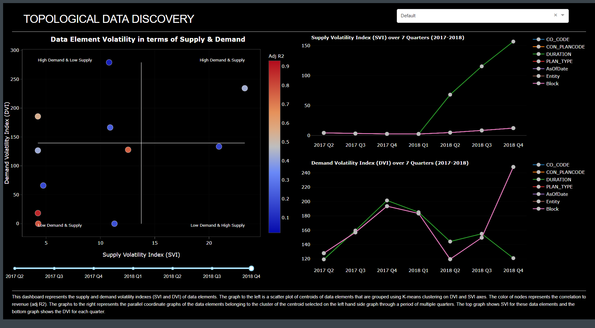

# data-discovery-dashboard
An analytics dashboard in Dash (Plotly) to visualize important indicators using clustering and parallel coordinate plots. 

In this dashboard, we have used the centroids as nodes, as discussed in the methodology section in the report to represent points on a scatter plot of DVI-SVI axes. With this synthesized and clustered topology of nodes representing data elements with color overlay of correlation to revenue, we can gain a lot of information about the data. The plot quadrants tell us what the demand and supply level of each node is. Based on this and its correlation to revenue, we can say how redundant or how valuable those elements are in terms of profitability for the company. Drilling down each node into its component data elements on the parallel coordinate graph tells us how the data point has been changing over time.  
 
